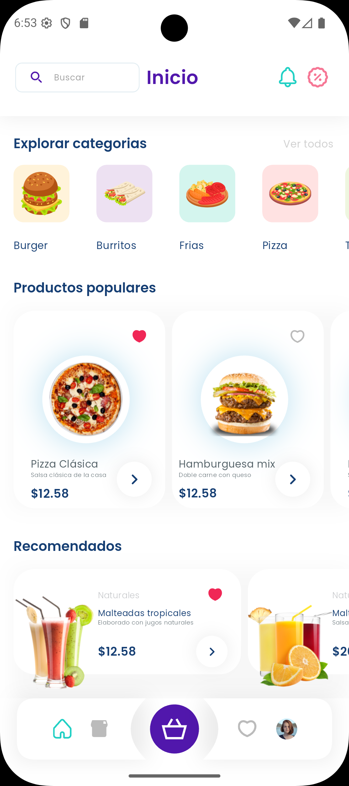
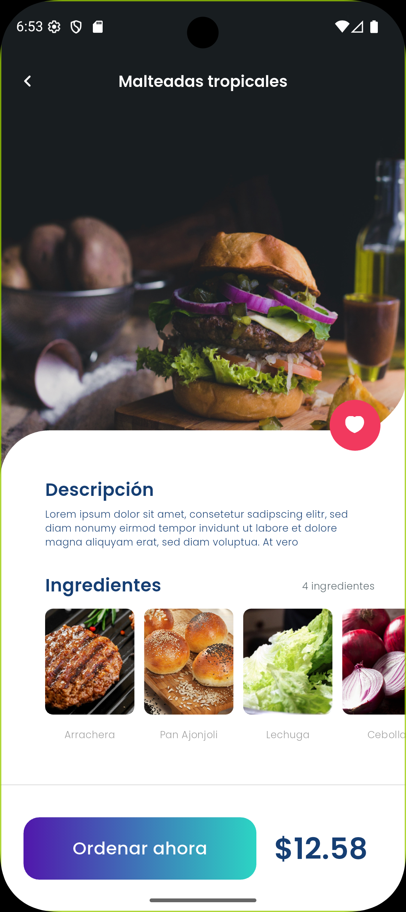
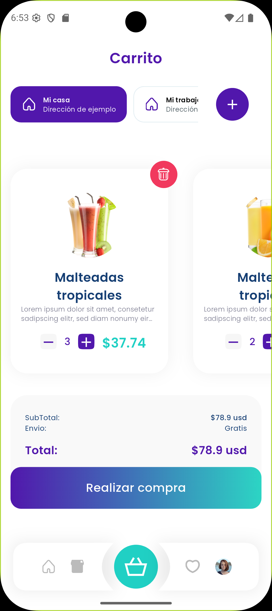

# Delivery App — Flutter Intern Task

<p align="center">
	<a href="https://alexforprog.com" target="_blank" rel="noopener">
		
		
	</a>
	<br />
	
	
	
	
</p>

This repository contains a small delivery demo app developed for an interview
task for the Flutter Intern position at AlexApps. The implementation focuses on
clean architecture, readable code, state management, and a concise, testable
UI rather than production-scale infrastructure.

## **Purpose**

- **Interview task for AlexApps**: demonstrate practical Flutter skills and
	engineering approach expected from a junior/entry-level Flutter engineer.

## **Features Implemented**

- Product listing (home screen) with categories and popular/recommended lists.
- Product details screen with add-to-cart flow.
- Simple cart with quantity management and persisted state (via `hydrated_bloc`).
- Clean, responsive UI using `flutter_screenutil` for adaptive sizing.
- JSON-based local data source for products and categories (assets).
- Dependency injection using `injectable` + `get_it`.
- Code generation for JSON serializable models and DI configuration.
- **Custom App Icon**: uniquely generated and configured for Android and iOS.

## **Tech Stack**

- Flutter & Dart (SDK >= 3.6)
- State management: `flutter_bloc` + `hydrated_bloc`
- Dependency injection: `injectable` + `get_it`
- JSON serialization: `json_serializable` + `json_annotation`
- UI helpers: `flutter_screenutil`, `flutter_svg`
- Local asset data (JSON) for sample products and categories


## **Architecture & Project Structure**

The project follows a lightweight Clean Architecture-inspired structure that
keeps domain, data and presentation concerns separated and easy to navigate:

- `lib/home/` — feature folder for the home screen
	- `data/` — DTOs, asset data sources, repository implementation
	- `domain/` — domain models and interfaces
	- `presentation/` — Cubit/Bloc and UI widgets/screens
- `lib/cart/` — cart feature with presentation and state management
- `lib/product_details/` — product details UI and state
- `lib/core/` — shared widgets, theme, and utilities
- `lib/di/` — dependency injection setup (`di_config.dart` generated files)
- `lib/router/` — app routing and navigation parameter models

This layout keeps feature code co-located while clearly separating data,
domain and UI layers to make the codebase easy to scan and extend.

## **State Management Approach**

- Primary: `flutter_bloc` (Cubit/Bloc patterns) for predictable state
	transitions and testability.
- Persistence: `hydrated_bloc` for simple, file-backed state persistence of the
	cart between app launches.

Why this choice:
- `flutter_bloc` is explicit, easy to reason about (good for interviews), and
	well-suited to small-to-medium apps where side effects and state transitions
	should be explicit and testable.
- `hydrated_bloc` provides simple persistence without introducing a database
	layer, which fits an interview project scope.

## **How to run the project locally**

Prerequisites:
- Install Flutter (see https://docs.flutter.dev/get-started/install)
- Ensure a device or emulator is available.

Steps:

1. Clone the repository and open it:

	 ```bash
	 git clone <repo-url>
	 cd delivery_app
	 ```

2. Install dependencies:

	 ```bash
	 flutter pub get
	 ```

3. Generate code (models and DI):

	 ```bash
	 flutter pub run build_runner build --delete-conflicting-outputs
	 ```

	 - For continuous generation during development you can use `watch` instead
		 of `build`:

	 ```bash
	 flutter pub run build_runner watch --delete-conflicting-outputs
	 ```

4. Run the app on a connected device or emulator:

	 ```bash
	 flutter run -d <device-id>
	 ```

5. (Optional) Run tests:

	 ```bash
	 flutter test
	 ```

Note: the project uses `hydrated_bloc`. On desktop the storage is file-backed;
on mobile it uses platform appropriate storage provided by `path_provider`.

## **Screenshots**

Add screenshots to the `screenshots/` folder and replace these placeholders:

<p align="center">
  
  
  
</p>

## **Assumptions & Trade-offs**

- Data is loaded from local JSON assets (no network layer) to keep the project
	focused and deterministic for the interview.
- Authentication and user accounts were out of scope.
- Error handling is pragmatic and focused on UX; exhaustive edge-case handling
	and analytics were not included due to time constraints.
- The app targets a demonstrative UI/UX; production concerns such as CI/CD,
	localization, and complex offline syncing are omitted.

## **Possible Improvements (with more time)**

- Add network-backed data fetching with repository/network layers and
	retry/caching policies.
- Add full unit and widget test coverage for critical flows.
- Implement localization and theming variants.
- Improve accessibility (semantics, screen reader labels, contrast checks).
- Replace `hydrated_bloc` persistence with a well-defined repository backed by
	SQLite or secure storage for user data.
- Add CI pipeline for static analysis (`flutter analyze`) and tests.

## **Notes to Reviewers**

- Focus areas:
	- Clean architecture: check separation between `data`, `domain`, and
		`presentation` layers.
	- State management: review `Cubit`/`Bloc` patterns and `hydrated_bloc`
		usage in the `cart` feature.
	- DI: review `lib/di/di_config.dart` and generated files for sensible
		registrations.
	- Readability: look for clear naming, small functions, and short widgets.
	- Code generation: verify `json_serializable` model code and generated
		DTO mappings.

- What I did not spend time on (explicitly): advanced performance
	optimizations, exhaustive integration tests, and backend integration.

If you'd like, I can:
- Add a short video walkthrough or GIFs for the main flows.
- Add a focused test suite for the cart logic.

---

If you need any clarifications about design choices or specific files,
please let me know and I will walk through them.
